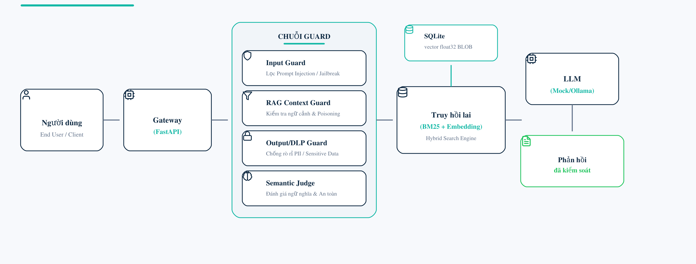
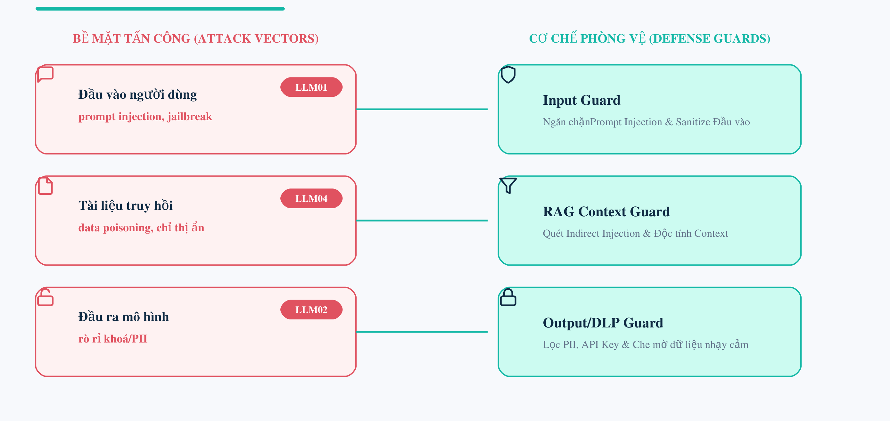
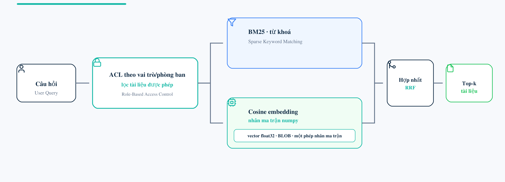

# Shield AI — Enterprise LLM Security Framework

> A lab-scale **LLM Security Gateway** that sits in front of a Retrieval-Augmented
> Generation (RAG) application and enforces a defense-in-depth guard chain against
> prompt injection, indirect injection, jailbreaks, and data leakage.


**Đề tài:** *Nghiên cứu và triển khai cơ chế Guardrails bảo vệ hệ thống RAG trước
tấn công Prompt Injection và rò rỉ dữ liệu.*

This is a university graduation-internship **proof-of-concept**. It is built and
evaluated with **100% synthetic data** and **locally-hosted models**, and it makes
**no production or real-world security guarantees**.

---

## Key results

Measured on a synthetic evaluation set of **425 cases** (200 attacks inspired by
garak / PyRIT / InjecAgent + 225 benign, including 125 *hard-benign* traps). All
numbers are lab-scale and do not generalize to production.

| Configuration | TPR (recall) | FPR | Notes |
|---|:---:|:---:|---|
| **Rule-based guard** | **97.0%** | **0.0%** | Deterministic; balanced operating point |
| + Semantic Judge (`qwen3:4b`) | 100% | 26.7% | Opt-in, **default OFF** — precision ROI negative |
| Reference (`hermes3:8b`) | 100% | 66.7% | Over-blocks — not operable |

- **Clean-canary A/B demo:** with a secret canary seeded **only in the knowledge
  base**, the unguarded path leaked it in **12/18** trials while the guarded path
  leaked **0/18** (system-level comparison; small `n`, not a statistical claim).

**Progressive rule ablation** — recall improved across three targeted, non-overfit
steps while FPR stayed at 0% (same 425 cases):

| Step | TPR | FPR | PyRIT | garak | InjecAgent |
|---|:---:|:---:|:---:|:---:|:---:|
| Baseline | 48.5% | 0.0% | 0% | 75.2% | 47.4% |
| + Anti-impersonation | 77.0% | 0.0% | 100% | 75.2% | 47.4% |
| + Unicode normalization | 81.5% | 0.0% | 100% | 83.8% | 47.4% |
| **+ Anti-indirect-injection** | **97.0%** | **0.0%** | **100%** | **94.3%** | **100%** |

**Confusion matrix** — rule-based, after optimization (`n = 425`):

|  | Blocked | Answered |
|---|:---:|:---:|
| **Attacks (200)** | 194 (TP) | 6 (FN) |
| **Benign (225)** | 0 (FP) | 225 (TN) |

> **Honest scope.** FPR 0% holds only on the synthetic benign set and does not
> generalize out-of-distribution. `100%` on the PyRIT family reflects its current
> template set (paraphrased evasions still bypass the rules). Latency is not
> reported (methodology decision). See [Limitations](#limitations--scope).

---

## Architecture

<p align="center">
  
</p>
<p align="center"><em>End-to-end request flow — FastAPI gateway → guard chain → hybrid retrieval → LLM → controlled response.</em></p>

Guards follow a **fail-closed** principle (the strictest decision wins) and wrap the
RAG pipeline at three points — input, retrieved context, and output. **Five guard
modules** live in `app/guards/` (Input · Provenance · RAG Context · DLP · Output),
plus **ACL/RBAC** enforced before retrieval and an optional Semantic Judge
(default OFF). Input is normalized (NFKC, zero-width stripping, homoglyph folding)
before rule matching to defeat Unicode evasion.

### Threat model

<p align="center">
  
</p>
<p align="center"><em>Three attack surfaces (OWASP LLM01 / LLM04 / LLM02) and the guard that defends each.</em></p>

### Retrieval with access control

<p align="center">
  
</p>
<p align="center"><em>Role/department ACL is applied <strong>before</strong> retrieval; BM25 (keyword) and cosine-embedding (numpy) results are fused by Reciprocal Rank Fusion.</em></p>

---

## Features

- **Defense-in-depth guard chain** with a fixed severity order and fail-closed decisions.
- **Input normalization** (NFKC, zero-width stripping, Cyrillic→Latin homoglyph folding) to defeat Unicode evasion before rule matching.
- **Role/department access control (RBAC)** applied *before* retrieval, independent of content guards.
- **Hybrid retrieval:** BM25 (SQLite FTS5) + `float32` embeddings scored via a single `numpy` matrix multiply, fused with Reciprocal Rank Fusion.
- **Output DLP** for API keys, PEM blocks, bearer tokens, PII, and canary markers.
- **Deterministic, offline evaluation:** a Mock Provider and local models via Ollama — no paid API, no external network on the main path.
- **Provenance-stamped runs:** every evaluation records commit, model, config, and dataset hash for reproducibility.
- **Independently-governed 120-case benchmark** (`datasets/v2/`), SHA-256 frozen, with an unexecuted holdout split reserved for future evaluation.

---

## Quick start

```bash
python -m venv .venv
# Windows: .venv\Scripts\Activate.ps1   |   macOS/Linux: source .venv/bin/activate
pip install -r requirements.txt

uvicorn app.main:app --reload      # then open http://127.0.0.1:8000/docs
pytest -q                          # run the test suite
```

The main path is **offline by default** (deterministic Mock Provider). To enable
the optional Semantic Judge, install [Ollama](https://ollama.com), pull a model,
and set `SEMANTIC_GUARD_USE_LLM=1`.

**Reproduce the results:**

```bash
python scripts/run_v3_evaluation.py     # 425-case security evaluation → reports/v3/<run-id>/
python scripts/run_demo_ab_paired.py    # clean-canary A/B demo (guarded vs unguarded)
```

---

## Repository structure

```text
app/                    FastAPI gateway, guard chain, retrieval, RBAC workspace
  guards/               input · provenance · rag · dlp · output · acl · semantic
  retrieval/            SQLite FTS5/BM25 + ACL-aware retriever
  workspace/            RBAC store, hybrid retrieval, business-document seed
datasets/               synthetic corpora + v2 benchmark (SHA-256 frozen)
scripts/                evaluation runners, benchmark build/freeze, validators
tests/                  pytest unit + integration suite
chatbot/                minimal demo UI (guarded vs unguarded)
redteam/                synthetic attack prompt manifest
reports/                evaluation runs, evidence, A/B artifacts
docs/                   architecture, methodology, decisions (ADRs), diagrams
bao_cao_latex_dot2/     LaTeX source of the thesis report
```

---

## Evaluation & methodology

Two complementary datasets support the claims:

- **425-case effectiveness set** — measures TPR / FPR / Stop-before-LLM / exfil on
  three guard configurations (rule-based, Semantic Judge `qwen3:4b`, reference `hermes3:8b`).
- **Benchmark V2 (120 cases)** — 23 scenario families, 30/30/60 dev/val/holdout
  split, 172-document corpus, three independent content banks per family for
  contamination control, deterministic build, SHA-256 frozen. The 60-case holdout
  is **reserved and not executed**.

Every reported figure traces to an artifact under `reports/` produced by a
provenance-stamped run. See [`docs/`](docs/) for the architecture, benchmark
methodology, and Architecture Decision Records.

---

## Limitations & scope

- **Lab-scale PoC** — no production or enterprise-readiness claim.
- **Synthetic data and local models only** — never evaluated on a real commercial LLM or real enterprise data.
- **FPR 0% does not generalize** beyond the synthetic benign set; some legitimate out-of-distribution queries can still be blocked.
- **Residual recall gap:** 6/10 direct knowledge-base exfiltration prompts pass the input rules (an Input-Guard limitation; cross-user access control is the separate RBAC layer's job, measured independently).
- **A/B demo is qualitative** — system-level, repetitions are not statistically independent, small `n`.
- The rule layer is **not adaptive**: paraphrased attacks that drop the targeted lexical invariants can still evade it.

---

## Team

| Name | Student ID | Class |
|---|---|---|
| Nguyễn Văn An | N22DCAT001 | D22CQAT01-N |
| Lê Đình Nghĩa | N22DCAT038 | D22CQAT01-N |

**Supervisor:** ThS. Nguyễn Hoàng Thanh · Khoa Công nghệ Thông tin 2, Học viện
Công nghệ Bưu chính Viễn thông (PTIT).

---

## References & standards

The attack families and defenses are *inspired by* — not copied from — established
work: OWASP Top 10 for LLM Applications, OWASP LLMSVS, and NIST AI 600-1 for risk
framing; Perez & Ribeiro (2022) and Greshake et al. (2023) for prompt/indirect
injection; PoisonedRAG (Zou et al., 2024) and InjecAgent (Zhan et al., 2024) for
RAG poisoning; Llama Guard (Inan et al., 2023) and NeMo Guardrails (Rebedea et al.,
2023) for defenses; and Hackett et al. (2025) on guardrail evasion. Full citations
are in [`bao_cao_latex_dot2/refs.bib`](bao_cao_latex_dot2/refs.bib).

## License

Academic project — license to be determined by university/institution policy.
