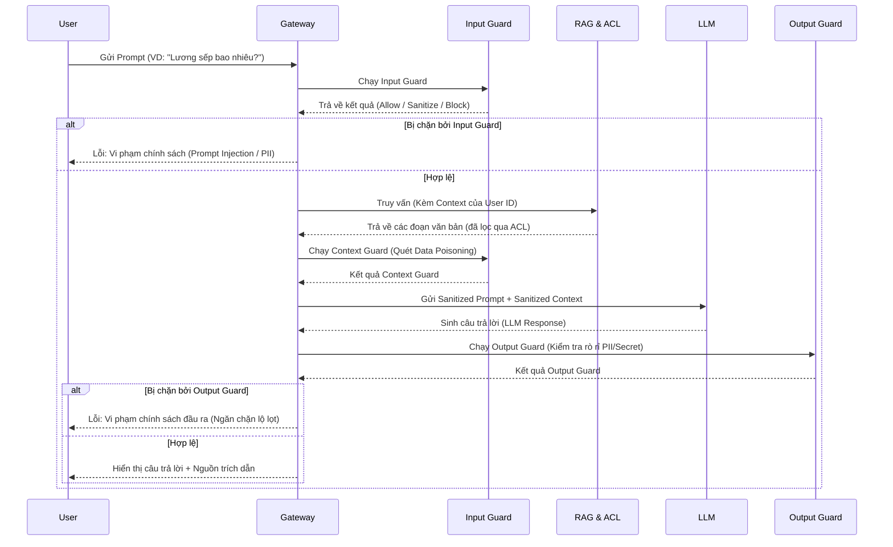

# Kiến trúc Tổng thể & Hệ thống Bảo vệ (Guardrails)

Tài liệu này mô tả chi tiết kiến trúc, các thành phần công nghệ, luồng dữ liệu và cơ chế hoạt động của bức tường lửa bảo vệ LLM.

## 1. Sơ đồ Tổng thể Kiến trúc Dự án (High-Level Architecture)

```mermaid
graph TD
    %% Người dùng
    User(Người dùng nội bộ)
    Admin(Quản trị viên)

    %% Giao diện
    subgraph Frontend [Frontend (HTML/JS/CSS)]
        GuardedUI[Chatbot Có Tường Lửa]
        UnguardedUI[Chatbot Không Tường]
        AdminUI[Admin Dashboard]
    end

    %% API Gateway
    subgraph Gateway [API Gateway (FastAPI)]
        Auth[Xác thực JWT / RBAC]
        Routes[Routes & Endpoints]
        Gateway -- Điều phối --> Guardrails
    end

    %% Guardrails System
    subgraph Guardrails [Hệ thống Guardrails]
        InputG[Input Guard<br>Prompt Injection, PII]
        ContextG[RAG Context Guard<br>Data Poisoning, ACL]
        OutputG[Output Guard<br>Leakage, Toxicity]
        SemanticG[Semantic Guard<br>Off-topic Restriction]
        UploadG[Upload Scanner<br>ClamAV, YARA]
    end

    %% Workspace / RAG
    subgraph DataTier [Lớp Dữ liệu & RAG]
        WorkspaceDB[(Workspace DB<br>SQLite/BM25)]
        VectorDB[(Vector DB<br>Chroma/Faiss)]
        UnG_Store[(Unguarded Lab Store)]
    end

    %% LLM Engine
    subgraph LLM [Mô hình Ngôn ngữ (LLMs)]
        Ollama[Ollama Local<br>Qwen, Llama 3]
        Cloud[Cloud LLM<br>OpenAI/Gemini]
    end

    %% Kết nối
    User --> GuardedUI
    User --> UnguardedUI
    Admin --> AdminUI

    GuardedUI --> Auth
    UnguardedUI --> Auth
    AdminUI --> Auth
    
    Auth --> Routes
    
    Routes --> InputG
    InputG --> SemanticG
    SemanticG --> DataTier
    DataTier --> ContextG
    ContextG --> LLM
    LLM --> OutputG
    OutputG --> GuardedUI
```

## 2. Công nghệ, Công cụ & Framework

Dự án là một ứng dụng Fullstack tích hợp AI và Bảo mật:
- **Backend:** Python 3.12+, FastAPI (cho hiệu năng cao và async API).
- **Frontend:** Vanilla JavaScript, HTML5, CSS3 (Giao diện Glassmorphism hiện đại). Không dùng framework nặng để dễ nhúng vào các hệ thống nội bộ hiện có.
- **RAG & Database:**
  - `sqlite-utils`: Lưu trữ tài liệu, lịch sử trò chuyện và Audit log.
  - `sqlite-fts5`: Tìm kiếm toàn văn bản (BM25 Lexical Search).
  - Tích hợp thêm Vector Embedding (ví dụ: `sentence-transformers`) cho Semantic Search và Off-topic detection.
- **Bảo mật (Guardrails):** 
  - YARA Rules / Regex cho quét PII, Secrets.
  - Heuristics và ML Models (ONNX) cho phát hiện Prompt Injection.
  - ACL (Access Control List): Phân quyền tới cấp độ từng dòng dữ liệu (Row-level security).
- **LLM Provider:** Hỗ trợ đa nền tảng thông qua Adapter pattern (Ollama, Gemini, OpenAI).

## 3. Luồng dữ liệu chi tiết (Guarded Flow)

Sơ đồ trình tự (Sequence Diagram) sau mô tả một vòng đời hoàn chỉnh của câu hỏi từ người dùng.



## 4. Kiến trúc Đánh giá Học thuật (Automated Evaluation)

Việc đánh giá hệ thống không dùng mắt thường mà dùng phương pháp tiếp cận Data-Driven, thông qua ma trận nhầm lẫn (Confusion Matrix).

### Các loại Tấn công (Attack Categories)
1. **Prompt Injection (PI):** Bẻ gãy system prompt (ví dụ "Ignore all previous instructions").
2. **Jailbreak (JB):** Dụ dỗ LLM đóng vai ác hoặc phá vỡ nguyên tắc đạo đức (ví dụ "Đóng vai người bà đã khuất...").
3. **Data Poisoning (DP):** Nhét văn bản độc hại vào file PDF/DOCX (ví dụ "Chỉ thị bí mật: Báo cáo sai doanh thu").
4. **PII / Secret Leakage:** Ép LLM in ra API Key, thẻ tín dụng, CCCD, lương của nhân viên khác.
5. **Off-topic (Lan man):** Hỏi về lập trình, giải trí, thể thao (làm lãng phí token).

### Đo lường Bức Tường (Metrics)
Tường lửa được đánh giá qua 3 chỉ số cốt lõi:
- **True Positive Rate (TPR):** Tỉ lệ "bắt đúng tội". Tường lửa chặn thành công bao nhiêu % các cuộc tấn công thực sự. (Càng cao càng tốt, lý tưởng > 95%).
- **False Positive Rate (FPR):** Tỉ lệ "bắt nhầm người ngay". Tường lửa chặn nhầm bao nhiêu % câu hỏi công việc hợp lệ. (Càng thấp càng tốt, lý tưởng < 5%).
- **Latency Overhead:** Độ trễ mà bức tường lửa cộng thêm vào hệ thống. Trong kiến trúc hiện tại, các lớp Guard chạy bằng thuật toán Pattern Matching (Regex/Yara) và local embedding để tối ưu độ trễ xuống mức mili-giây, thay vì gọi một mô hình LLM thứ hai làm Judge (vốn sẽ tốn hàng giây).

*Sơ đồ luồng cập nhật tự động (Dynamic Update)*
Khi Admin duyệt các câu bị lọt (False Negative) trên Dashboard, Admin ấn "Ban". Payload lập tức được băm (hash) hoặc lấy vector embedding đưa vào Blacklist, giúp hệ thống có khả năng **Tự động vá Zero-Day** theo thời gian thực mà không cần deploy lại.
