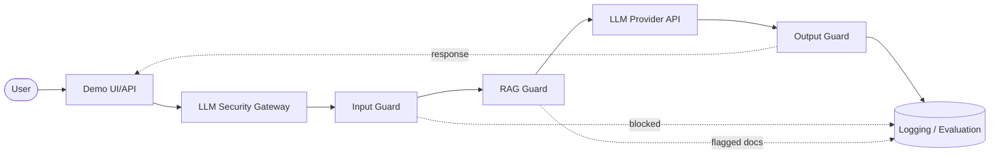

# Architecture Diagram (Phase 0 target design)

> This reflects the **planned** MVP architecture. Nothing here is implemented yet — see `TASK_BOARD.md` for phase status.

## High-Level Flow

## Component Notes

- **Demo UI/API** — thin client (Streamlit and/or FastAPI endpoint) used to exercise the gateway during development and demo.
- **LLM Security Gateway** — orchestrates the guard pipeline; single entry point for all LLM interactions.
- **Input Guard** — screens raw user input for prompt injection and jailbreak patterns before any retrieval or LLM call.
- **RAG Guard** — screens/sanitizes documents retrieved from the vector store before they're placed into the LLM context; defends against indirect prompt injection and document poisoning.
- **LLM Provider** — external API-based LLM (no local training in MVP).
- **Output Guard** — screens LLM output for sensitive information leakage and policy violations before returning to the user.
- **Logging/Evaluation** — structured JSONL logs of guard decisions, used for the Phase 7 evaluation harness.

## Status

Diagram reflects the target design agreed for the MVP. Framework/vector-store choices referenced implicitly by "LLM Provider" and the (not-yet-drawn) retrieval store are deferred to later ADRs.
