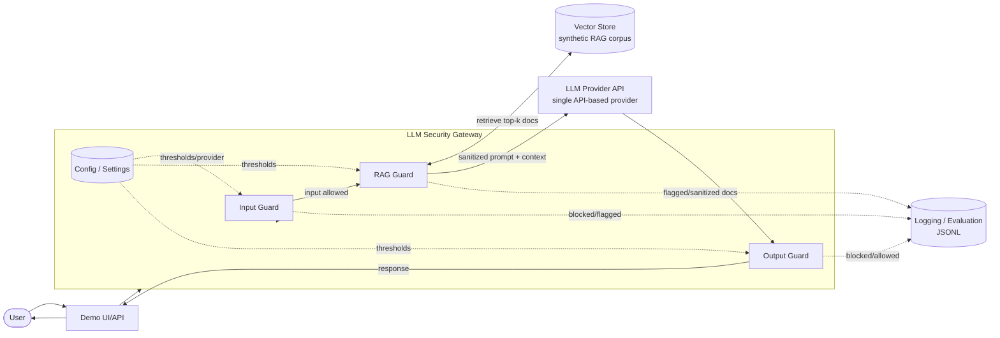

# Architecture Documentation (Phase 2)

> This reflects the **planned** MVP architecture for a lab-scale internship project. Nothing here is implemented yet — see `TASK_BOARD.md` for phase status. No code, packages, or APIs are touched by this document; it is a design artifact only.

## 1. Functional Requirements (FR)

| ID | Requirement |
|---|---|
| FR1 | The Gateway shall accept a user query from the Demo UI/API and route it through Input Guard before any retrieval or LLM call. |
| FR2 | Input Guard shall classify user input for direct prompt injection and jailbreak patterns, and allow, flag, or block accordingly. |
| FR3 | For allowed input, the system shall retrieve candidate documents from a vector store holding a synthetic RAG corpus. |
| FR4 | RAG Guard shall screen retrieved documents for embedded/indirect instructions and known poisoning indicators before they enter the LLM prompt context. |
| FR5 | The Gateway shall send the sanitized prompt + retrieved context to a single API-based LLM provider. |
| FR6 | Output Guard shall screen the LLM's raw completion for sensitive information leakage (system-prompt leakage, synthetic secret/PII patterns) before it reaches the user. |
| FR7 | The system shall log every guard decision (allow/flag/block, reason code, timestamp, request ID) in structured JSONL format. |
| FR8 | The system shall support running a batch of synthetic red-team prompts/documents against the gateway and recording a pass/fail result per guard, for the Phase 7 evaluation harness. |
| FR9 | Configuration (LLM provider selection, guard thresholds, log paths, vector store path) shall be externally configurable via `.env`/settings, not hardcoded. |

## 2. Non-Functional Requirements (NFR)

| ID | Requirement | Rationale |
|---|---|---|
| NFR1 | The full MVP (gateway + demo RAG + vector store) shall run locally on a laptop with **16GB RAM**, no GPU required, no cloud infrastructure beyond the chosen LLM API. | Team is 2 students on personal laptops — see `docs/decisions/ADR-001-mvp-scope.md`. |
| NFR2 | Guard checks should add reasonable, demo-usable latency to each request. | No numeric target is set yet — a fabricated "Xms" figure would violate `AGENT_RULES.md` rule 3; actual measurement happens in Phase 7. |
| NFR3 | All guard decisions must be logged in structured, machine-readable form (JSONL) sufficient to reconstruct why any single request was allowed/flagged/blocked. | Supports Phase 7 evaluation and STRIDE Repudiation mitigation (see `threat-model.md`). |
| NFR4 | No real PII, secrets, or private/proprietary documents anywhere in the system, including logs and test fixtures. | `AGENT_RULES.md` rule 5. |
| NFR5 | Evaluation runs must be reproducible from checked-in code, config, and data — no undocumented manual steps. | `AGENT_RULES.md` rule 9/10. |
| NFR6 | No paid API call happens without prior explicit approval; dry-run/mock modes are preferred while developing guard logic. | `AGENT_RULES.md` rule 4. |
| NFR7 | Favor simple, explainable rule/heuristic-based detection over heavy ML infrastructure, given the 2-student lab-scale team and timeline. | Feasibility constraint. |
| NFR8 | The MVP shall run as a single process or, later, a simple Docker Compose stack — **no container orchestration (Kubernetes) and no SIEM integration** are MVP requirements. | See §5 MVP vs Future Thesis Scope. |
| NFR9 | Every phase produces documentation/evidence sufficient for the periodic report deadlines. | `AGENT_RULES.md` rule 10; `PROJECT_PLAN.md` §7/§9. |

## 3. High-Level Architecture Diagram

## 4. Module Responsibility Table

| Module | Responsibility | Talks to | Target Phase |
|---|---|---|---|
| Demo UI/API | Thin client (Streamlit and/or a FastAPI endpoint) used to exercise the gateway during development and demo. | Security Gateway | Phase 3 |
| Security Gateway (orchestrator) | Single entry point; sequences Input Guard → RAG Guard → LLM call → Output Guard; applies config. | All guards, Config, LLM Provider Adapter | Phase 3 |
| Config / Settings | Centralizes environment-driven configuration (provider choice, guard thresholds, paths). No secrets committed (`AGENT_RULES.md` rule 5). | Gateway, all guards | Phase 3 |
| Input Guard | Detects direct prompt injection and jailbreak patterns in raw user input; allow/flag/block. | Gateway, Logging | Phase 4 |
| RAG Guard | Retrieves candidate documents; screens/sanitizes them for embedded instructions and poisoning indicators before they enter the LLM context. | Vector Store, Gateway, Logging | Phase 5 |
| Vector Store (RAG corpus) | Stores and serves the synthetic document corpus used for retrieval. | RAG Guard | Phase 5 |
| LLM Provider Adapter | Isolates provider-specific API call logic behind one interface, so the provider can be swapped without touching guard logic. | Security Gateway, external LLM API | Phase 3/5 |
| Output Guard | Screens LLM completions for sensitive-information leakage and policy violations before returning to the user. | Gateway, Logging | Phase 6 |
| Logging/Evaluation | Structured JSONL logging of every guard decision; batch runner + metrics for the Phase 7 evaluation harness. | All guards | Phase 3 (logging) / Phase 7 (evaluation) |

## 5. MVP Scope vs. Future Thesis Scope

| Area | MVP (this internship, Phase 0–9) | Future Thesis / Beyond-Internship Scope |
|---|---|---|
| Deployment | Single process locally, optional simple Docker Compose (one host) | **Kubernetes** / container orchestration, autoscaling, multi-host deployment |
| Observability | JSONL structured logs, optional SQLite for local querying | **SIEM integration** (e.g., shipping logs to Splunk/ELK/Sentinel), alerting pipelines, SOC integration |
| Detection approach | Rule/heuristic-based guards; optional LLM-as-judge with explicit approval | **Locally fine-tuned/trained detection models**; custom classifier training pipelines |
| LLM access | Single API-based LLM provider | Multi-provider routing/failover; local model hosting via Ollama as an *optional* later exploration (already noted in `PROJECT_PLAN.md`, still not MVP) |
| Agent surface | None — no tool-use, no autonomous agents | Multi-agent / autonomous tool-use security (Excessive Agency, Insecure Plugin Design categories) |
| Data scale | Small synthetic RAG corpus, sized to fit comfortably in 16GB RAM | Enterprise-scale corpora, real (non-synthetic) data pilots |
| Assurance/compliance | Project-defined checklist loosely inspired by OWASP LLMSVS (see `docs/research/llmsvs-checklist.md`) | Pursuing an actual LLMSVS assurance level or formal compliance certification |
| Availability | Single instance, no HA guarantees | High-availability, multi-tenant production hardening |

This split exists specifically so Kubernetes, SIEM, and fine-tuning are **never accidentally treated as MVP requirements** — per explicit instruction, they are recorded only as future thesis scope. Any future decision to pull one of these into active scope requires a new ADR and sign-off, not silent expansion (`AGENT_RULES.md` rule 1).

## 6. Risks and Mitigations (architecture-level)

| Risk | Impact | Mitigation |
|---|---|---|
| Gateway is a single point of failure / bottleneck | Medium — acceptable for a lab demo, not for production | Explicitly out of scope to solve via HA in MVP; documented as a known limitation in the final report. |
| Guard heuristics both under-block and over-block (false negatives/positives) | High — core to whether the MVP "works" | Phase 7 evaluation harness measures this against the synthetic red-team set; no numeric target promised until measured (`AGENT_RULES.md` rule 3). |
| 16GB RAM laptop insufficient if a heavy local embedding model or large vector index is chosen | Medium | Keep the RAG corpus small and synthetic; prefer lightweight/API-based embeddings if local embedding proves too heavy — to be revisited in the Phase 5 RAG-framework ADR. |
| Team scope creep into Kubernetes/SIEM/fine-tuning under deadline or ambition pressure | Medium | Explicit §5 table above + `AGENT_RULES.md` rule 1 scope-creep gate; any such addition needs a new ADR. |
| Three sequential guard calls add perceptible latency to the demo | Low–Medium | Favor lightweight rule/regex-based first-pass detection; gate any heavier LLM-as-judge call behind explicit approval (`AGENT_RULES.md` rule 4). |
| Framework lock-in (RAG orchestration / vector store choice) decided too early or too late | Medium | Decision deliberately deferred to a dedicated ADR at Phase 5 start, informed by Phase 1 tool research (`docs/research/tool-comparison.md`). |

## 7. Component Notes

- **Demo UI/API** — thin client used to exercise the gateway during development and demo.
- **LLM Security Gateway** — orchestrates the guard pipeline; single entry point for all LLM interactions.
- **Input Guard** — screens raw user input for prompt injection and jailbreak patterns before any retrieval or LLM call.
- **RAG Guard** — screens/sanitizes documents retrieved from the vector store before they're placed into the LLM context; defends against indirect prompt injection and document poisoning.
- **LLM Provider** — external API-based LLM (no local training in MVP).
- **Output Guard** — screens LLM output for sensitive information leakage and policy violations before returning to the user.
- **Logging/Evaluation** — structured JSONL logs of guard decisions, used for the Phase 7 evaluation harness.

## Status

Diagram and requirements reflect the target design agreed for the MVP as of Phase 2. Framework/vector-store choices are still deferred to a later ADR (§5, and `docs/decisions/ADR-001-mvp-scope.md`). No implementation exists yet.
