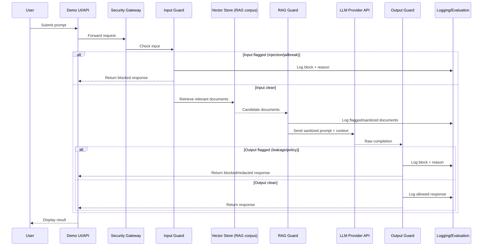

# Data Flow Diagram

> Planning-level data flow for the MVP. Reflects target design only — see `TASK_BOARD.md` for implementation status.

## Request/Response Data Flow

## Notes

- Every branch (blocked input, flagged document, blocked output, allowed output) writes to the Logging/Evaluation sink — this is the basis for the Phase 7 evaluation harness.
- "Sanitized prompt + context" means the RAG Guard has removed or neutralized suspected injected instructions before assembling the final LLM prompt.
- No user data leaves the system to any destination other than the configured LLM Provider API and local logs.

## Status

Target design for Phase 3–7 implementation. No code implements this flow yet.
