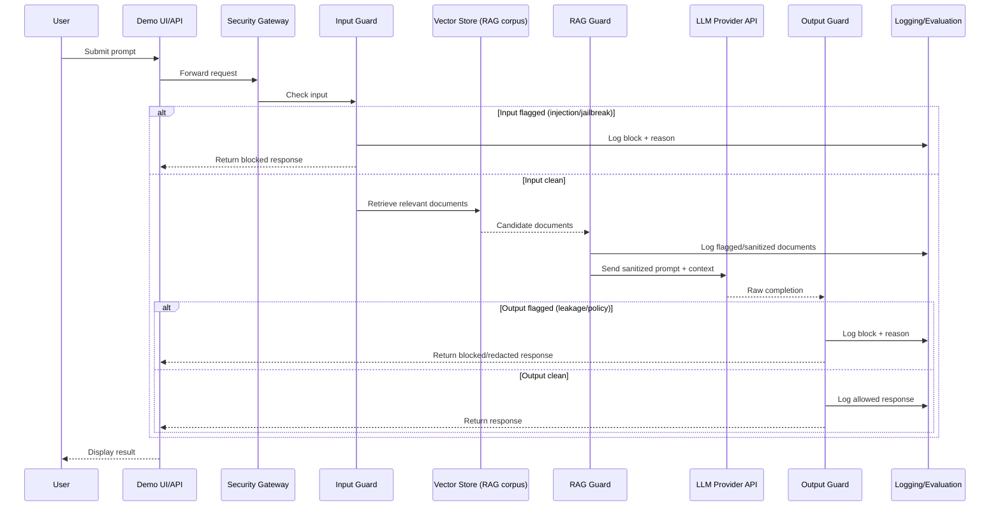
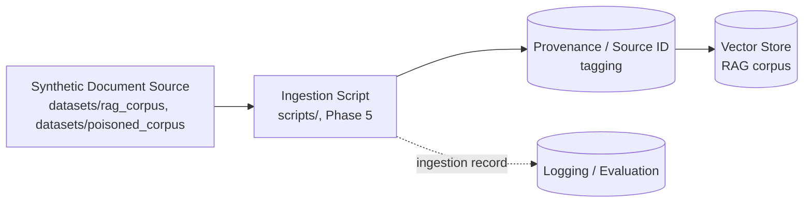

# Data Flow Diagrams — Phase 2

> Planning-level data flow for the MVP. Reflects target design only — see `TASK_BOARD.md` for implementation status. Modules referenced below are defined in `docs/diagrams/architecture.md` §4 (Module Responsibility Table).

## 1. Request/Response Data Flow

### Notes

- Every branch (blocked input, flagged document, blocked output, allowed output) writes to the Logging/Evaluation sink — this is the basis for the Phase 7 evaluation harness and the STRIDE Repudiation mitigation in `threat-model.md`.
- "Sanitized prompt + context" means the RAG Guard has removed or neutralized suspected injected instructions before assembling the final LLM prompt.
- No user data leaves the system to any destination other than the configured LLM Provider API and local logs.

## 2. Document Ingestion Data Flow (planned)

The request/response flow above assumes documents already exist in the Vector Store. This second flow covers how synthetic documents get there, since the threat model's Spoofing and Tampering-at-ingestion rows (`docs/diagrams/threat-model.md`) depend on it.

### Notes

- Every ingested document is tagged with a provenance/source ID at ingestion time — this directly implements the Spoofing mitigation in `threat-model.md` ("track document provenance/source ID").
- This flow is **planning-level only** — `scripts/` and `datasets/` are currently empty per their own READMEs; ingestion logic is Phase 5 work, not implemented by this documentation-only pass.
- The "poisoned_corpus" source in the diagram refers to the synthetic poisoned-document test set planned in `TASK_BOARD.md` Phase 2 ("Synthetic poisoned-document set (RAG poisoning)"), not a real threat feed.

## Status

Target design for Phase 3–7 implementation. No code implements either flow yet. This document only adds design detail (the ingestion flow) on top of the Phase 0 draft; no packages were installed and no APIs were called to produce it.
