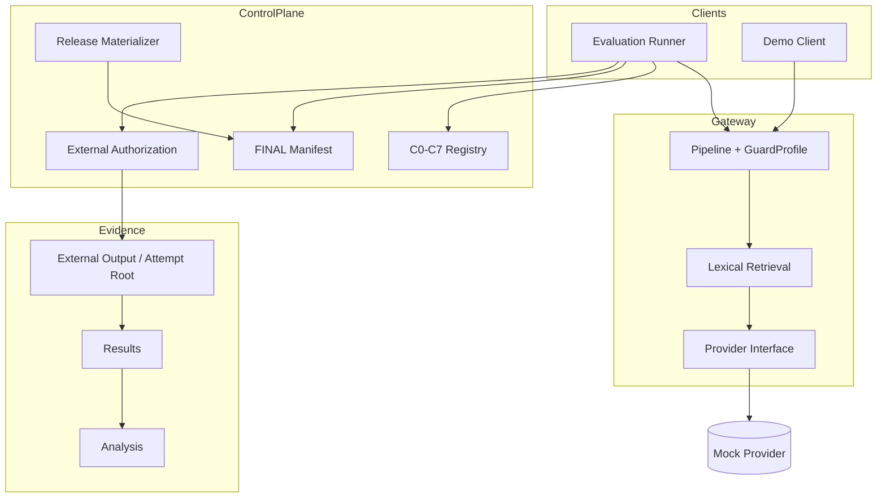

# Architecture and Threat Model

**Identities:** base `93ad09d…` · Phase 12F HEAD `409e5f3…`

---

## 1. Request gateway (lab PoC)

```text
Client / Evaluation Runner
        |
        v
+---------------------------+
| API surface + Pipeline    |
| GuardProfile-selected     |
| stages (C0-C7 registry)   |
+---------------------------+
        |
        +--> input-side guards (when enabled)
        v
+---------------------------+
| Lexical RAG retrieval     |
| temporary SQLite corpus   |
+---------------------------+
        |
        +--> context / provenance-related controls (when enabled)
        v
+---------------------------+
| LLM provider interface    |
| Mock Provider in eval     |
+---------------------------+
        |
        +--> output / DLP-related controls (when enabled)
        v
  Projected response + content-free eval fields
```

### Mermaid — system context



### Text fallback

```text
[Runner/Demo] -> [Pipeline/Guards] -> [Retrieval] -> [Provider: Mock in eval]
      |                                                   |
      +--> [C0-C7 + FINAL manifest]                       +--> projected response
      |
      +--> [External authorization] -> [Attempt root] -> results/analysis
      |
      +--> [Materializer] byte-copies ignored FINAL artifacts (no-clobber)
```

---

## 2. Guards and policy decisions

Guards are **profile-selected booleans** (GuardProfile), not free-form runtime plugins. Evaluation uses a **fixed C0–C7 registry** with canonical **config hashes** so matrices cannot silently change meaning.

Policy decisions along the path include allow/block/stop-style outcomes recorded for evaluation in content-free form. Exact stop-reason taxonomies follow implementation on the cited HEAD (do not invent additional decision enums in prose).

---

## 3. Retrieval

Lab retrieval is **lexical** over documents ingested into a **temporary SQLite** corpus for a run. It is not dense-embedding vector RAG. Indirect injection analysis must be interpreted under this simplified retrieval regime.

---

## 4. Evidence collection

| Artifact | Role |
|---|---|
| `result.json` + `result-manifest.json` | Per-config run identity and projected case outcomes |
| `analysis.json` / table / analysis-manifest | Matrix-level rates and claims_control |
| Start receipt (holdout) | Pre-load identity snapshot after attempt claim |
| FINAL manifest | Benchmark byte authority |

Provenance fields bind git commit, provider behavior hash, benchmark manifest hash, config hash, and expected case-set hash (as implemented).

---

## 5. Release-materialization trust boundaries

| Zone | Trust |
|---|---|
| Git tree | Source identity; clean SHA |
| Tracked FINAL manifest JSON | Allowlist of artifacts to materialize |
| Ignored `*.jsonl` on disk | Present only after materialization or sealed copy |
| Materializer | Byte hash/size verify; no JSONL parse; no-clobber publish |
| Operator | Trusted maintainer; not malicious admin |

Paths with `..`, absolute forms, or symlink/reparse components are rejected.

---

## 6. Mock Provider boundary

| Allowed | Not claimed |
|---|---|
| Deterministic offline evaluation | Commercial model behavior |
| Fair ablations without API cost | Stochastic attack success rates on live models |
| Reproducible CI-friendly runs | Production abuse resistance |

---

## 7. Operator and filesystem threat assumptions

**Assumed:** single trusted operator; offline machine; no concurrent hostile process with write access to evidence directories.

**Best-effort only:** hard-link races against local admin; Windows directory-entry durability after crash; reparse TOCTOU under adversarial FS control.

**Explicitly out of scope:** cryptographic proof that “no global negative event occurred.” Use **NOT_VERIFIABLE** for absolute negative claims about all possible hosts and attackers.

---

## 8. Evaluation control plane (holdout)

```text
External canonical authorization
  -> parse + identity preclaim (byte FINAL verify; no semantic preclaim validator)
  -> atomic attempt root claim + receipt
  -> capability (procedural)
  -> authorized holdout load
  -> C0-C7 one-shot publish
  -> holdout analyzer (complete matrix only)
```

Ordinary `--split` never includes holdout.
