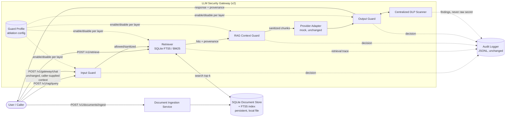

# Modernization V2 Architecture (Phase 12A)

> Target architecture for the v2 modernization wave. Nothing in this document
> is implemented yet. This extends, and does not replace,
> `docs/diagrams/architecture.md` (the original Phase 2 MVP architecture,
> which remains accurate for Phase 0-11 as-built). See
> `docs/modernization-final-plan.md` for how this direction was chosen.

## 1. Target Component Diagram



`POST /v1/gateway/chat` keeps its Phase 0-11 behavior exactly (caller-supplied
`context_chunks`, no retrieval). It is the regression-safety anchor for every
phase below — if a phase ever breaks it, that phase's acceptance criteria is
not met.

## 2. New Module Responsibility Table

Extends `docs/diagrams/architecture.md` §4. Only new/changed modules are
listed; existing guards keep their current responsibility.

| Module (target path) | Responsibility | Talks to | Target phase |
|---|---|---|---|
| `app/retrieval/models.py` | `DocumentRecord`, `ChunkRecord`, `RetrievalHit`, `RetrievalQuery` typed contracts | Retriever, Ingestion | 12B |
| `app/retrieval/base.py` | `Retriever` protocol (`upsert_documents`, `search`, `delete_document`) so a future vector/hybrid retriever can be swapped in without touching callers | Ingestion, RAG Query Service | 12B |
| `app/retrieval/sqlite_bm25.py` | Persistent SQLite schema, FTS5 virtual table, parameterized CRUD, `bm25()`-ranked search, deterministic tie-breaking, short-lived connections | SQLite file on disk | 12B |
| `app/services/chunking.py` | Deterministic paragraph-aware chunker (replaces ad hoc fixed-window chunking for v2 ingestion; `app/services/dataset_loader.py` v1 chunker is untouched) | Ingestion Service | 12B |
| `app/services/ingestion.py` | Validation, size limits, SHA-256 hashing, deduplication, transactional batch ingestion, server-assigned source/trust policy | SQLite store, Chunking | 12B |
| `app/services/rag_query.py` | Orchestrates Input Guard -> Retriever -> RAG Guard -> existing gateway/provider path for the new end-to-end query flow | Input Guard, Retriever, RAG Guard, Provider | 12C |
| `app/guards/dlp_guard.py` | Centralized `DLPFinding` detectors + redaction, shared by Output Guard and audit logger instead of duplicated patterns | Output Guard, Audit Logger | 12C |
| `app/core/pipeline.py` | `GuardProfile`: immutable, named layer-enable/disable configuration used only by the ablation runner, never by production endpoints | Ablation Runner | 12C (definition), 12E (used) |
| `app/services/ablation_runner.py` | Executes the v2 benchmark once per `GuardProfile`, compares results, computes marginal contribution | Guards, Retriever, `GuardProfile` | 12E |
| `app/services/evaluation_store.py` | Reads a fixed, already-generated evaluation artifact for the optional read-only summary endpoint; never triggers a run or accepts a caller-supplied path | Generated reports only | 12E or later, only if `GET /v1/evaluation/summary` is built |

`app/services/dataset_loader.py` (v1) is not modified by this plan. If v2
ingestion needs to reuse v1's clean/poisoned documents as seed content for
manual smoke-testing, it does so by calling the existing loader and adapting
its output into `DocumentRecord` at the call site — the benchmark-only
`is_poisoned` field is dropped at that boundary and never stored in the v2
index or used by any runtime decision (see `docs/modernization-v2-threat-model.md`
§3 for why).

## 3. Data Model (target)

```text
DocumentRecord
  document_id: str        # stable, deterministic (e.g. hash of source+content)
  source: str              # server-assigned ingestion source identifier
  trust_level: str          # server-assigned, e.g. "trusted_internal" | "untrusted_external"
  content_hash: str        # SHA-256 of raw content, for dedup/change detection
  ingested_at: str         # ISO 8601 timestamp, server-assigned
  metadata: dict[str, str]  # free-form, caller MAY suggest, server validates

ChunkRecord
  chunk_id: str            # stable, deterministic (document_id + chunk_index)
  document_id: str
  chunk_index: int
  text: str
  # trust_level is NOT duplicated here as a separately settable field --
  # it is always read through the parent DocumentRecord to prevent a
  # caller or a bug from setting a chunk's trust independently of its
  # source document.

RetrievalHit
  chunk: ChunkRecord
  score: float              # bm25() raw score
  rank: int                 # deterministic rank after tie-breaking

RetrievalQuery
  query: str
  top_k: int                # bounded, server-enforced maximum
  metadata: dict[str, str]
```

This intentionally mirrors the existing `RAGContextChunk` shape
(`app/schemas/requests.py`) closely enough that `RAGQueryService` can convert
`RetrievalHit` -> `RAGContextChunk` and hand off into the **existing,
unchanged** `evaluate_rag_context()` and `run_chat()` functions rather than
forking guard logic for the new path.

## 4. Trust and Provenance Model

- Trust is a property of the **document's ingestion source**, assigned by
  server-side configuration at ingestion time (e.g. a small, explicit
  source-policy table such as `{"synthetic_clean_corpus": "trusted_internal",
  "synthetic_external_feed": "untrusted_external"}`), never accepted as a
  request field from `POST /v1/documents/ingest` callers.
- The RAG Guard (or a thin provenance-check step ahead of it) can use
  `trust_level` as an **independent signal** from content-based rule
  matching — a low-trust chunk can be flagged even if its text matches no
  content rule; a high-trust chunk is still subject to full content
  scanning (trust does not bypass content checks). This directly supports
  required decision C: both "clean content, low-trust source" and
  "compromised content, high-trust source" must be representable and
  distinguishable in evaluation.
- `DocumentChunk.is_poisoned` (v1 benchmark ground truth, defined in
  `app/services/dataset_loader.py`) is never read by any runtime code path
  in v2. It may only ever be used offline, by the evaluation runner, to
  score whether a decision was correct against a known label — the same
  role it already plays in v1's evaluation runner today.
- **Added per the Phase 12A audit (Grok, Major finding on auditability):**
  every ingestion's source-to-`trust_level` mapping decision must be
  recorded in the structured audit log (extending the existing JSONL
  logging convention from `app/services/audit_logger.py`), not just applied
  silently. This is the concrete implementation of the Repudiation-row
  mitigation already listed in `docs/modernization-v2-threat-model.md` §3 —
  restated here in the architecture document itself so Phase 12B/12C
  implementers see it as a design requirement, not only a threat-model
  observation.

## 5. Centralized DLP

`app/guards/dlp_guard.py` (target) becomes the single source of truth for
secret/PII detection patterns currently duplicated across
`app/guards/rag_guard.py` (fake-secret marker), `app/guards/output_guard.py`
(fake-secret marker, API-key-shaped patterns, email pattern), and
`app/services/audit_logger.py` (its own independent secret-redaction safety
net). Consolidation target for Phase 12C:

- `DLPFinding` (detector id, category, span, redact-or-flag) as the shared
  result type.
- Output Guard and the audit logger both call the same detector set instead
  of maintaining separate copies of `FAKE_SECRET_PATTERN` and friends.
- The audit logger's defense-in-depth redaction pass (redacting independent
  of what a guard decided) is preserved as a deliberate safety net, not
  removed — centralization must not weaken it.

## 6. API Surface (target, additive only)

| Endpoint | Status | Behavior |
|---|---|---|
| `POST /v1/gateway/chat` | **Unchanged** | Existing Phase 0-11 behavior; caller supplies `context_chunks` directly; no retrieval. Preserved as the regression baseline. |
| `POST /v1/guard/input`, `POST /v1/guard/output`, `POST /v1/guard/rag-context` | **Unchanged** | Existing Phase 4-5 direct-guard endpoints. |
| `POST /v1/documents/ingest` | New, Phase 12B | Batch document ingestion; validation, size limits, dedup, server-assigned trust; returns indexed/updated/quarantined/rejected counts. Never accepts a caller-supplied `trust_level`. |
| `POST /v1/retrieve` | New, Phase 12B | Retrieval-only: runs the `Retriever.search()` step and returns ranked hits with provenance. No guard pipeline runs. Exists for retrieval-quality evaluation and debugging in isolation from guard behavior. |
| `POST /v1/rag/query` | New, Phase 12C | Full guarded path: Input Guard -> Retriever -> RAG Guard -> provider -> Output Guard, using the same decision/severity model as `run_chat()`. Returns the response plus retrieval provenance. |
| `GET /v1/evaluation/summary` | New, optional, Phase 12E or later | Read-only; serves a fixed, already-generated evaluation artifact. Never triggers a live run; never accepts a caller-supplied filesystem path. Deferred until v2 evaluation artifacts actually exist. |

## 7. Phase Boundaries

Each phase below follows the same required structure: objective, allowed
files, prohibited files, acceptance criteria, tests, rollback plan, report
impact, explicit stop condition. No phase after 12A is authorized to start
by this document alone — each requires its own explicit go-ahead per
`AGENT_RULES.md` rule 12.

### Phase 12A — Modernization Scope Lock and V2 Architecture (this phase)

- **Objective:** reconcile the three external reviews plus the earlier
  feasibility review into one approved direction, phase plan, and set of
  architecture/threat-model/ADR documents. No code.
- **Allowed files:** `docs/modernization-final-plan.md`,
  `docs/modernization-v2-architecture.md`,
  `docs/modernization-v2-threat-model.md`,
  `docs/decisions/ADR-002-retrieval-engine.md`,
  `docs/decisions/ADR-003-v2-benchmark.md`; `README.md`, `TASK_BOARD.md`,
  `docs/weekly-notes/week-01.md` (short notes only).
- **Prohibited files:** `app/`, `tests/`, `scripts/`, `datasets/`,
  `redteam/`, `reports/evaluation/`, `report-latex-template/`.
- **Acceptance criteria:** all five new documents exist; TASK_BOARD records
  Phase 12A; conflicts between the three reviews are explicitly listed with
  a resolution and rationale; no prohibited path was touched (verified via
  `git diff --check` and a path review, see closing summary).
- **Tests:** none (documentation only); `git status`/`git diff --check` used
  as the verification mechanism instead of `pytest`.
- **Rollback plan:** revert the new/changed files; zero runtime impact since
  no code changed.
- **Report impact:** provides the "why v2" narrative and the ADRs Chapter 3
  of the final report will cite.
- **Stop condition:** stop after this document set is produced; do not begin
  Phase 12B implementation without an explicit go-ahead.

### Phase 12B — Retrieval Foundation

- **Objective:** implement persistent SQLite FTS5/BM25 retrieval and
  document ingestion, with no guard-pipeline or API-visible behavior change
  to `/v1/gateway/chat`.
- **Allowed files:** new `app/retrieval/`, new `app/services/chunking.py`,
  new `app/services/ingestion.py`, new `app/schemas/` additions for
  ingestion/retrieval request-response models, new `app/api/routes.py`
  additions for `POST /v1/documents/ingest` and `POST /v1/retrieve` only,
  `requirements.txt` (no new dependency expected — `sqlite3` is standard
  library; update only if a genuine need appears, subject to
  `AGENT_RULES.md` rule 11), new tests under `tests/`.
- **Prohibited files:** `app/guards/rag_guard.py`, `app/guards/input_guard.py`,
  `app/guards/output_guard.py`, `app/services/gateway.py`,
  `app/services/evaluation_runner.py`, `datasets/`, `redteam/`,
  `reports/evaluation/`, `report-latex-template/`.
- **Acceptance criteria (strengthened per the Phase 12A audit — Gemini's
  finding that acceptance criteria must be verifiable, not circular
  adjectives):**
  1. A document ingested via the (future) ingestion path is retrievable by
     an exact-keyword query matching its content, and the returned rank
     order is identical across repeated runs against the same corpus
     (deterministic ranking, checked by test, not asserted by prose).
  2. The FTS5 capability check runs before the first retrieval-dependent
     operation and, if FTS5 is unavailable, the system raises a fatal,
     clearly-worded error and serves **zero** retrieval-dependent requests —
     verified by a test that simulates the unavailable case and asserts no
     partial/degraded response path exists.
  3. Every existing test in the current suite (82 tests as of Phase 12A)
     passes unmodified, and `/v1/gateway/chat` produces byte-identical
     responses to its Phase 0-11 behavior for the same inputs.
- **Tests:** ingestion validation/limits/dedup/hashing/transactional-failure;
  retrieval ranking, tie-breaking, upsert-replaces-stale-rows; **adversarial
  FTS5 query strings using `NEAR`, column-filter syntax, boolean operators
  (`AND`/`OR`/`NOT`), and unbalanced quoting must not raise an unhandled
  exception, must not alter the query's intended scope beyond the caller's
  own search terms, and must not bypass SQL parameterization (added per the
  Phase 12A audit, Grok's finding on FTS5 operator abuse — see also
  `ADR-002-retrieval-engine.md`'s strengthened query-safety wording)**; full
  existing suite (currently 82 tests) still passes unmodified.
- **Rollback plan:** entire feature is additive (new modules, new endpoints);
  disable by not routing to the new endpoints; delete the SQLite file to
  reset state; no existing endpoint or guard logic is touched.
- **Report impact:** enables the "real retrieval exists" claim; supports
  Chapter 3 architecture section and Chapter 4 Recall@k metrics later.
- **Stop condition:** stop once ingestion + retrieval are demonstrated end to
  end with passing tests; do not wire retrieval into the guarded chat path
  yet (that is Phase 12C).

### Phase 12C — RAG Query Service, Provenance, and Centralized DLP

- **Objective:** add `POST /v1/rag/query` (Input Guard -> Retriever -> RAG
  Guard -> provider -> Output Guard), server-controlled trust/provenance,
  and centralized DLP, without changing `/v1/gateway/chat` or the frozen v1
  benchmark's guard behavior.
- **Allowed files:** new `app/services/rag_query.py`, new
  `app/guards/dlp_guard.py`, targeted additions to `app/guards/rag_guard.py`
  and `app/guards/output_guard.py` to delegate to the shared DLP module
  (behavior-preserving refactor, not a rule-logic change), `app/api/routes.py`
  addition for `POST /v1/rag/query`, new tests.
- **Prohibited files:** `datasets/`, `redteam/`, `reports/evaluation/`,
  `report-latex-template/`; no change to v1 rule *decisions* (regex
  consolidation must not change any existing test's expected outcome).
- **Acceptance criteria:** a query against ingested documents returns a
  guarded response with retrieval provenance; a low-trust source is
  distinguishable in the response/audit log from a high-trust one, and the
  source-to-trust-level mapping decision is itself present in the audit log
  for every ingested document (per §4 above); DLP detectors run from one
  shared module; the full existing test suite (82 tests) still passes with
  zero behavior changes. **Added per the Phase 12A audit (Grok, Critical
  finding on multi-chunk coordination):** this phase must explicitly decide
  and document, in its own evidence, whether a lightweight cross-chunk
  co-occurrence heuristic (§3 of `docs/modernization-v2-threat-model.md`,
  Tampering row) is implemented. If implemented, it needs a named test
  case demonstrating it flags a constructed multi-chunk scenario; if
  deferred, the evidence must say so explicitly — silently omitting this
  decision fails the phase's acceptance criteria even though full
  resolution of the underlying risk is not required.
- **Tests:** end-to-end `/v1/rag/query` happy path, blocked/human-review
  stop path, sanitize-continues path (mirroring the existing
  `test_gateway_routes.py` pattern); provenance correctly attached and
  never caller-overridable; **a named regression test suite that runs the
  centralized DLP module's redaction against every existing secret/PII
  fixture currently covered by `app/guards/rag_guard.py`,
  `app/guards/output_guard.py`, and `app/services/audit_logger.py`
  independently, and asserts byte-identical redaction output before and
  after consolidation (strengthened per the Phase 12A audit, Grok's finding
  that this must be a named, not general, test requirement)**.
- **Rollback plan:** new endpoint and new module are additive; the
  guard-to-DLP delegation refactor is scoped and covered by regression
  tests before merge, so a failing regression blocks the phase rather than
  silently shipping a behavior change.
- **Report impact:** this is the first phase that can demonstrate the full
  target architecture diagram (§1 above) actually running.
- **Stop condition:** stop once `/v1/rag/query` is demonstrated with
  provenance and centralized DLP, and the full existing suite is green; do
  not author the v2 benchmark yet (Phase 12D) using this phase's own code
  as the design reference, to avoid designing the benchmark around whatever
  the implementation happens to catch.

### Phase 12D — Benchmark v2 Generation and Freeze

- **Objective:** author a new, separately versioned v2 benchmark (dev,
  validation, holdout splits) covering the threat categories in
  `docs/modernization-v2-threat-model.md`, without modifying v1.
- **Allowed files:** new folder(s) under `redteam/v2/` (or the structure
  finalized in `ADR-003-v2-benchmark.md`), a new manifest/hash file, new
  documentation describing the v2 corpus (mirroring
  `docs/dataset/dataset-methodology.md`'s existing pattern for v1).
- **Prohibited files:** `redteam/prompts.jsonl`, `redteam/expected-behaviors.yaml`,
  `redteam/attack-categories.md`, `datasets/clean/`, `datasets/poisoned/`,
  any file under `reports/evaluation/`, `app/`.
- **Acceptance criteria:** v2 corpus exists with dev/validation/holdout
  splits, **at least 100 cases in total** (statistical floor per the Phase
  12A audit — see `docs/modernization-final-plan.md` §4.E and
  `ADR-003-v2-benchmark.md`), and roughly balanced benign/malicious content
  per `docs/modernization-v2-threat-model.md`; a SHA-256 manifest freezes
  the corpus; v1 files are provably untouched (hash comparison); **v1
  content is provably absent from the v2 validation and holdout splits**
  (added per the Phase 12A audit — v1 may only ever appear, if at all, in
  the development split); holdout content was not referenced while any
  Phase 12B/12C rule or detector was authored, and holdout authoring
  followed the independence rule in `ADR-003-v2-benchmark.md` (different
  author, a documented time gap, or an independent review pass before
  freeze — a timeline/process attestation, not a technical test).
  **No numeric detection-rate target is part of this phase's acceptance
  criteria** — see `docs/modernization-final-plan.md` §3 for why.
- **Tests:** structural validation mirroring
  `docs/dataset/dataset-validation-report.md`'s existing checks (JSONL/schema
  validity, no duplicate IDs, no real PII/secrets, canonical decision
  taxonomy values); SHA-256 immutability test for the new v2 manifest,
  following the same pattern `tests/test_evaluation_runner.py` already uses
  for v1.
- **Rollback plan:** entirely new files; deleting the new folder fully
  reverts this phase with zero effect on v1 or any implemented code.
- **Report impact:** enables Chapter 4's "V1 was calibration, V2 is
  evaluation" narrative, directly answering the overfitting concern raised
  by all three reviews.
- **Stop condition:** stop once the v2 corpus is frozen and hashed; do not
  run the evaluation/ablation harness against it yet (Phase 12E) in the
  same sitting as authoring it, to keep authoring and evaluation
  demonstrably separated in time.

### Phase 12E — Ablation, Retrieval-Security, and Latency Evaluation

- **Objective:** run the v2 benchmark through `GuardProfile`-based ablation,
  compute the metrics defined in `docs/modernization-final-plan.md` §4.F,
  and generate reproducible reports.
- **Allowed files:** new `app/core/pipeline.py` (`GuardProfile`), new
  `app/services/ablation_runner.py`, new `scripts/run_evaluation_v2.py` (or
  an additive flag on the existing script, decided at implementation time),
  new tests, new `reports/evaluation/v2-*.{json,md}` artifacts (new
  filenames only — never overwriting `latest-evaluation.*` or
  `baseline-vs-guarded.*`, which remain the v1 historical artifacts).
- **Prohibited files:** `redteam/v2/` content itself (read-only input to
  this phase), `redteam/prompts.jsonl`, `datasets/`, any v1 file under
  `reports/evaluation/`.
- **Acceptance criteria:** every `GuardProfile` (at minimum `no_guards`,
  `input_only`, `rag_only`, `output_dlp_only`, `full`, and the
  `full_minus_<layer>` set) runs against the full v2 corpus and produces
  TPR/FPR/FNR/precision/recall/F1, Recall@k, poisoned-hit-rate@k,
  poisoned-context exposure, clean-context retention, leakage rate,
  redaction recall, benign over-redaction, and p50/p95 latency; results are
  reproducible from checked-in code and data with no manual step.
- **Tests:** each profile's guard-disabling is verified to actually disable
  only the intended layer; deterministic re-run produces identical metrics;
  latency measurement does not depend on wall-clock-sensitive external
  calls (mock provider only).
- **Rollback plan:** new modules and new report filenames only; no existing
  evaluation path is modified.
- **Report impact:** this is the phase that produces Chapter 4's core
  tables (ablation matrix, FPR/TPR breakdown, latency).
- **Stop condition:** this is the recommended stopping point for the core
  modernization wave (matches Codex's "PR5" recommendation and Gemini's
  academic stop condition). Phases 12F-12H require a separate, explicit
  go-ahead and are not implied by completing 12E.

### Phase 12F — Optional: Vector/Hybrid Retrieval

- **Objective:** add a vector or hybrid (BM25 + vector) retriever behind the
  existing `Retriever` protocol, as a second implementation, for comparison
  only.
- **Allowed files:** new `app/retrieval/vector_*.py` or
  `app/retrieval/hybrid_*.py`; `requirements.txt` update (new dependency —
  requires explicit approval per `AGENT_RULES.md` rule 11 before this phase
  starts, separate from Phase 12A's approval).
- **Prohibited files:** everything already frozen in earlier phases;
  `app/retrieval/sqlite_bm25.py` behavior must remain available and
  unchanged (comparison baseline).
- **Acceptance criteria:** a documented Recall@k / latency comparison
  between BM25-only and hybrid retrieval on the same frozen v2 corpus.
- **Tests:** new retriever passes the same `Retriever` protocol contract
  tests as the SQLite implementation.
- **Rollback plan:** additive, swappable via the `Retriever` protocol;
  removing the new implementation has no effect on 12B-12E.
- **Report impact:** optional "future work realized" section, only if time
  permits.
- **Stop condition:** do not start without explicit approval; do not let
  this phase block or delay 12E-derived report content (per Gemini's
  explicit warning against this exact failure mode).

### Phase 12G — Optional: Local LLM / Semantic Guard

- **Objective:** explore a deterministic-where-possible semantic layer
  (e.g., a lightweight local classifier or a tightly-scoped local LLM call)
  as an additional, clearly-labeled experimental guard layer.
- **Allowed files:** new, isolated module(s) only; must not replace the
  existing mock provider as the default.
- **Prohibited files:** everything frozen in earlier phases; must not change
  v1 or v2 benchmark expected-decision semantics.
- **Acceptance criteria:** any nondeterminism introduced is explicitly
  isolated and labeled as such in evaluation output (never silently mixed
  into the deterministic rule-based metrics from 12E).
- **Tests:** determinism/isolation boundary tests; explicit opt-in flag
  required, default-off.
- **Rollback plan:** fully optional and default-disabled; removing it
  reverts to the Phase 12E state exactly.
- **Report impact:** optional stretch section on hybrid rule+ML detection.
- **Stop condition:** requires explicit approval, including for any paid API
  use (`AGENT_RULES.md` rule 4) or new heavy dependency (rule 11); must not
  be started before 12E is complete.

### Phase 12H — Optional: Dashboard

- **Objective:** a thin, read-only visualization of guard decisions,
  provenance, and evaluation results, for demo purposes only.
- **Allowed files:** new, isolated UI module (e.g. Streamlit script) that
  only reads already-generated artifacts/endpoints; no new security logic.
- **Prohibited files:** everything else.
- **Acceptance criteria:** demo-usable read-only view of existing data; adds
  no new detection behavior.
- **Tests:** minimal — this is a presentation layer, not a security
  component; smoke-test that it starts and reads real artifacts.
- **Rollback plan:** fully optional, isolated, and last; deleting it affects
  nothing else.
- **Report impact:** demo/presentation value only.
- **Stop condition:** last phase; only attempted if all of 12B-12E are done
  and stable, per the approved direction's explicit "optional and last"
  ordering.

## 8. Metric Definitions (Formulas)

Added per the Phase 12A audit (Gemini, Major finding: metric names alone
risk implementation-time ambiguity/bias). These are **definitions to
implement in Phase 12E**, not results — every symbol below is computed from
the v2 corpus's known labels and the guard pipeline's actual decisions on a
given run; no value is asserted here.

Let `TP`, `TN`, `FP`, `FN` be counts over a chosen scenario set (e.g., one
`GuardProfile` run against the full v2 corpus, or a subset), where a
"positive" prediction means the pipeline returned a protective decision
(`block`, `sanitize`, or `human_review`) and a "positive" label means the
scenario is labeled malicious/poisoned/leaking in the v2 manifest:

- **TPR (recall, sensitivity)** = `TP / (TP + FN)` — fraction of malicious
  scenarios that received a protective decision.
- **FPR** = `FP / (FP + TN)` — fraction of benign scenarios that
  incorrectly received a protective decision.
- **FNR** = `FN / (TP + FN)` = `1 - TPR`.
- **Precision** = `TP / (TP + FP)`.
- **F1** = `2 * (Precision * TPR) / (Precision + TPR)`.

Retrieval-specific (only meaningful once Phase 12B retrieval exists):

- **Recall@k** = `(number of scenarios where at least one gold-relevant
  document ID appears in the top-k retrieved hits) / (total scenarios with
  a defined gold-relevant document set)`.
- **poisoned-hit-rate@k** = `(number of scenarios where at least one
  gold-labeled-poisoned document ID appears in the top-k retrieved hits) /
  (total scenarios that include a poisoned document in the ingested
  corpus)`. This measures whether poisoned content is *retrieved at all* —
  a prerequisite for, but not the same as, it reaching the provider.
- **poisoned-context exposure** = `(number of scenarios where at least one
  poisoned chunk is present in the context actually sent to the provider,
  i.e. survives the RAG Guard) / (total scenarios where a poisoned chunk
  was retrieved, i.e. the poisoned-hit-rate@k numerator)`. This isolates
  the RAG Guard's marginal effect on top of retrieval.
- **clean-context retention** = `(total legitimate/clean chunk-count
  surviving to the provider across all scenarios) / (total legitimate/clean
  chunk-count retrieved across all scenarios)`. A guard that "protects" by
  deleting all context, clean or not, scores low here even if TPR is high —
  this metric exists specifically to catch that failure mode.

DLP-specific:

- **Leakage rate** = `(number of scenarios where a synthetic canary/secret
  is present in the final returned response) / (total scenarios that
  contain a synthetic canary/secret anywhere in the ingested/context
  content for that scenario)`.
- **Redaction recall** = `(number of canary/secret instances correctly
  redacted in the final response) / (total canary/secret instances that
  were present in the raw provider output before Output Guard/DLP ran)`.
- **Benign over-redaction rate** = `(number of benign, non-secret spans
  incorrectly redacted) / (total benign spans that a human-authored
  reference marks as "should remain visible" across the benign scenario
  set)`. Requires the v2 benign scenarios to carry an explicit
  should-remain-visible reference span, authored at Phase 12D.

Performance:

- **p50/p95 latency** = the 50th/95th percentile of wall-clock time spent
  inside the security-middleware pipeline (Input Guard through Output Guard,
  including retrieval when applicable) for a run of N requests against the
  mock provider, measured in milliseconds. Excludes any real network call,
  since the default provider remains mock/offline through at least
  Phase 12E.

Ablation:

- **Per-layer marginal contribution** (for layer *L*) = `(protected-case
  count under the "full" GuardProfile) - (protected-case count under the
  "full_minus_L" GuardProfile)`, where "protected-case count" is the number
  of malicious/poisoned/leaking scenarios that received a protective
  decision under that profile. A positive value means layer *L* catches
  cases no other layer catches; a value near zero means *L*'s catches
  substantially overlap with other layers.
- **Unique catches** (for layer *L*) = count of scenarios protected only
  when *L* is enabled and no other single layer alone protects that same
  scenario (computed by comparing each `input_only`/`rag_only`/
  `output_dlp_only` profile's protected-case set pairwise).
