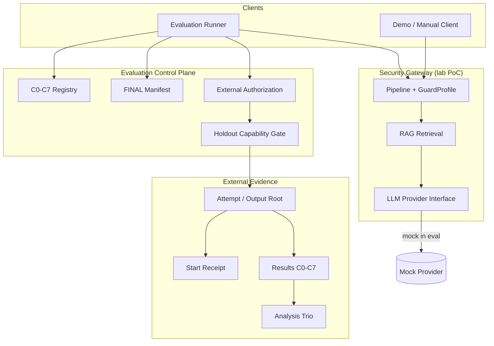

# Phase 12F — Release Architecture

**Base candidate:** `93ad09ddea90eb9712e82f3df5beacbd94399b9a`  
**Audience:** thesis report, technical defense, release packaging  
**Status of diagrams:** conceptual; derived from implemented modules on the candidate (observed structure), not a redesign

---

## 1. Purpose of the system

Lab-scale **LLM Security Gateway / Guardrail Proxy** standing in front of a **RAG** application path. Goals:

- Reduce prompt injection / jailbreak / leakage risk classes in a controlled PoC.
- Make guard contribution measurable via a fixed C0–C7 ablation matrix.
- Keep evaluation **reproducible**, **offline-capable** (mock provider), and **claim-controlled**.

This is an **academic proof-of-concept**, not a production security product.

---

## 2. Gateway and guard architecture

### 2.1 Request path (conceptual)

```text
Client / Evaluation Runner
        |
        v
+------------------+
|  API / Pipeline  |
+------------------+
        |
        +--> Input guards (when enabled by GuardProfile)
        |
        v
+------------------+
|  RAG retrieval   |  lexical / SQLite temporary corpus
+------------------+
        |
        +--> Context / provenance related controls (when enabled)
        |
        v
+------------------+
|  LLM provider    |  Mock Provider in authorized evaluation
+------------------+
        |
        +--> Output / DLP related controls (when enabled)
        |
        v
   Projected response + content-free evaluation fields
```

### 2.2 GuardProfile and C0–C7

Evaluation does not invent ad-hoc configurations. It uses a **fixed registry** of eight profiles (C0–C7):

- **C0** — all evaluated guards on (primary baseline for ablation narrative).
- **C1–C7** — single- or multi-guard ablations (e.g. no input, no provenance, no context, no DLP, no output, none, combined ablations).

Each config has a **canonical config hash**. Authorization and result identity bind those hashes so a matrix cannot silently change meaning.

### 2.3 Safety limits

Runtime safety settings (batch sizes, character caps, timeouts, top-k relationships, etc.) are validated for holdout **before** attempt-root claim (fail-closed ordering). Ordinary evaluation also applies project settings via the same application configuration surface.

---

## 3. Evaluation architecture

### 3.1 Ordinary path (development / validation)

```text
CLI --split development|validation --all-configs|--config ...
        |
        v
preflight (repo identity, FINAL manifest, split load via ordinary loader)
        |
        v
per-config execute (mock provider; temporary corpus)
        |
        v
atomic publish under output-root/raw/...
        |
        v
analyzer --split development|validation + eight manifests
```

**Hard boundary:** ordinary loaders and `--split` **cannot** load holdout.

### 3.2 Holdout path (authorized only)

```text
External canonical authorization file
        |
        v
parse + identity preclaim (no holdout record semantic scoring as “preclaim validator”)
        |
        v
atomic claim attempt root + start receipt
        |
        v
capability mint (procedural, process-local)
        |
        v
authorized holdout loader only
        |
        v
C0-C7 one-shot execute + per-config atomic publish
        |
        v
holdout analyzer (authorization + complete matrix + Stage A/B)
```

**Hard boundary:** capability is a **procedural misuse barrier** under a trusted-maintainer model, not a cryptographic enclave.

---

## 4. Evidence and provenance flow

```text
Frozen FINAL manifest (9 artifacts)
        |
        +--> byte identity (path, size, sha256)
        |
Benchmark split cases/labels/corpus (when authorized for that split)
        |
        v
Result.json + result-manifest.json per config
        |     (experiment_id, config_hash, provider_behavior_hash,
        |      git_commit, benchmark_manifest_sha256, expected_case_set_sha256, ...)
        v
Analysis.json + analysis-table.csv + analysis-manifest.json
        |     (claims_control, rates with min-n policy, latency non-reportable under L2, ...)
        v
Human report / thesis (must respect claims matrix)
```

Provenance principles:

1. **Content-free evaluation artifacts** for reporting surfaces that must not leak raw prompts/secrets.
2. **Identity fields** bind code commit, benchmark freeze, provider behavior, and configuration.
3. **Claims control flags** (e.g. no ABR, no macro, no p-values, latency non-reportable) are first-class outputs, not optional prose.

---

## 5. Artifact trust boundaries

| Zone | Trust role | Rules |
|---|---|---|
| Git repository | Source identity | Clean tree; exact SHA; no secrets |
| Frozen `datasets/v2` artifacts | Benchmark identity | FINAL manifest; byte verify; many `*.jsonl` may be gitignored and must be materialized |
| External authorization file | Holdout grant | Outside repo; canonical JSON; human-issued |
| External attempt root | One-shot evidence | Outside repo and outside frozen tree; never reuse; never delete after claim |
| Start receipt | Pre-load proof | Written before authorized load; independently rechecked by analyzer |
| Analysis directory under attempt | Publication | Refuse overwrite if exists |
| Thesis / demo machines | Consumption | Read evidence; do not rewrite history |

---

## 6. Mock Provider boundary

| Aspect | Rule |
|---|---|
| Authorized evaluation provider | `mock` only |
| Purpose | Determinism, offline cost control, ablation fairness |
| Not claimed | Behavior of commercial frontier models |
| Consequence | Some leakage / context-echo behaviors are **not** exercised as on a real model |

Any future real-LLM evaluation is a **new protocol** (new candidate, new authorization model, new claim set).

---

## 7. Repository / worktree / artifact separation

```text
Primary clone / release tag
    |
    +-- git worktree for documentation (e.g. phase-12f-grok-documentation)
    +-- git worktree for implementation experiments (if any)
    |
External evidence roots (never inside git as evaluation results)
    |
    +-- development smoke roots (diagnostic)
    +-- holdout attempt roots (one-shot; exploratory or future governance-valid)
    +-- authorization files (external)
```

**Observed operational fragility:** ignored `*.jsonl` means `git worktree add` may not copy frozen benchmark files. Materialization + byte-level FINAL verify is mandatory before evaluation.

---

## 8. Diagrams

### 8.1 Mermaid — system context



### 8.2 Text fallback (no Mermaid renderer)

```text
[Runner/Demo] -> [Pipeline/Guards] -> [RAG] -> [Provider: Mock in eval]
       |                ^
       |                |
       +--> [C0-C7 registry + FINAL manifest]
       |
       +--> [External authorization] -> [Capability] -> [Attempt root]
              |                            |
              |                            +--> receipt
              |                            +--> results C0-C7
              |                            +--> analysis
              v
        (outside git repository)
```

---

## 9. Non-goals of this architecture document

- Does not specify cloud deployment topology.
- Does not assert resistance to malicious administrators or hostile in-process attackers.
- Does not redefine metrics (AOMR/FPR policies remain as implemented on the candidate).
- Does not elevate exploratory holdout numbers into architecture “performance guarantees.”
